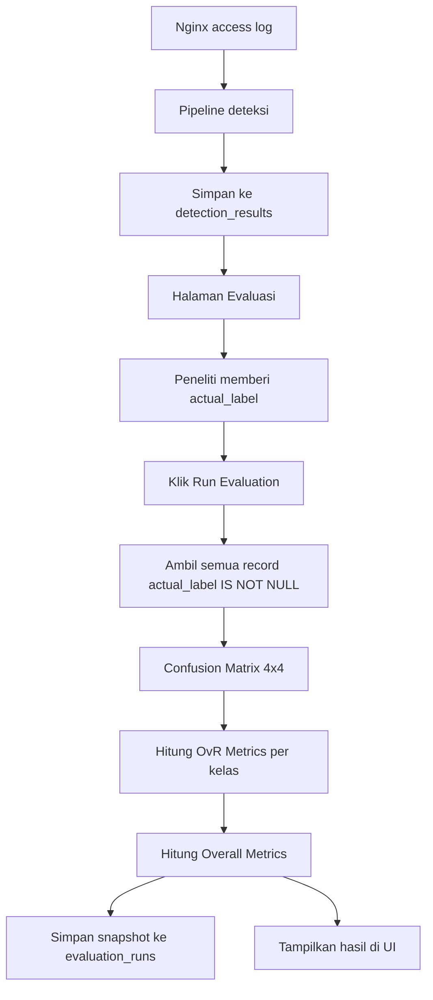

# Panduan Presentasi Evaluasi WebLog-IDS: Confusion Matrix 4×4 dan One-vs-Rest Strict

Dokumen ini menjelaskan fitur evaluasi klasifikasi pada **WebLog-IDS** untuk kebutuhan seminar hasil skripsi. Fokusnya adalah bagaimana sistem menghitung **TP, FP, TN, FN**, confusion matrix 4×4, metrik per kelas, dan overall metrics berdasarkan **label aktual manual** yang diberikan peneliti lewat dashboard.

---

## 1. Konteks Sistem

**WebLog-IDS** adalah sistem intrusion detection berbasis analisis **Nginx access log** secara realtime. Sistem membaca file log:

```text
/var/log/nginx/dvwa_access.log
```

Setiap baris log diproses melalui alur:

```text
Nginx access log
    -> parsing
    -> preprocessing / decoding payload
    -> rule matching
    -> klasifikasi
    -> simpan hasil ke database
```

Classifier menghasilkan 4 label prediksi:

| Label | Arti |
|---|---|
| `Normal` | Request tidak terdeteksi sebagai serangan |
| `XSS` | Request terdeteksi sebagai Cross-Site Scripting |
| `SQLi` | Request terdeteksi sebagai SQL Injection |
| `Multiple` | Request memicu rule XSS dan SQLi sekaligus |

Pada halaman **Hasil Deteksi**, label yang tampil adalah **label prediksi sistem**, bukan label kebenaran. Karena itu, agar bisa menghitung performa sistem, perlu ditambahkan **label aktual** dari peneliti.

---

## 2. Tujuan Fitur Evaluasi

Fitur evaluasi dibuat untuk menjawab pertanyaan:

> Seberapa akurat sistem WebLog-IDS dalam mengklasifikasikan request log sebagai `XSS`, `SQLi`, `Normal`, atau `Multiple`?

Untuk menjawab itu, sistem membandingkan:

| Komponen | Sumber |
|---|---|
| **Label Prediksi** | Hasil classifier WebLog-IDS, disimpan di `detection_results.label` |
| **Label Aktual / Ground Truth** | Label manual dari peneliti, disimpan di `detection_results.actual_label` |

Evaluasi hanya dilakukan pada baris yang sudah memiliki `actual_label`. Baris yang belum dilabeli tidak ikut dihitung.

---

## 3. Alasan Menggunakan Label Aktual Manual

Pada penelitian ini, peneliti melakukan pengujian secara terkendali menggunakan DVWA. Peneliti mengetahui kapan request normal dikirim dan kapan payload serangan dikirim.

Karena itu, ground truth diperoleh dengan cara:

1. Peneliti mengirim request normal dan payload serangan ke DVWA.
2. Nginx mencatat semua request ke access log.
3. WebLog-IDS mendeteksi dan memberi label prediksi.
4. Peneliti membuka halaman **Evaluasi**.
5. Peneliti memberi **Label Aktual** per baris melalui dropdown.
6. Jika semua serangan sudah dilabeli, peneliti dapat menekan tombol **Mark all unlabeled as Normal** untuk menandai sisa baris sebagai lalu lintas normal.

Justifikasi akademik yang bisa dipakai:

> Seluruh baris yang tidak diberi label eksplisit oleh peneliti diasumsikan sebagai lalu lintas normal, sesuai skenario pengujian terkendali di mana peneliti mengetahui kapan serangan dilakukan.

Catatan penting: sistem **tidak otomatis** menganggap baris kosong sebagai Normal. Harus ada aksi eksplisit lewat tombol **Mark all unlabeled as Normal**.

---

## 4. Struktur Data yang Ditambahkan

### 4.1 Kolom Baru di `detection_results`

Tabel utama hasil deteksi adalah:

```text
detection_results
```

Kolom yang ditambahkan:

| Kolom | Fungsi |
|---|---|
| `actual_label` | Label aktual dari peneliti: `XSS`, `SQLi`, `Normal`, `Multiple`, atau `NULL` jika belum dilabeli |
| `labeled_at` | Waktu saat label aktual diberikan |
| `labeled_by` | Sumber labeling, misalnya `manual` atau `auto-normal` |

Nilai `actual_label` awalnya `NULL`. Data lama tidak diubah sampai peneliti memberi label.

### 4.2 Tabel Baru `evaluation_runs`

Tabel ini menyimpan snapshot hasil evaluasi:

```text
evaluation_runs
```

Kolom:

| Kolom | Fungsi |
|---|---|
| `id` | ID evaluasi |
| `run_at` | Waktu evaluasi dijalankan |
| `accuracy` | Nilai accuracy saat evaluasi |
| `macro_f1` | Nilai Macro-F1 saat evaluasi |
| `json_result` | Hasil lengkap evaluasi dalam format JSON |

Tujuannya agar hasil evaluasi historis tidak hilang. Setiap kali tombol **Run Evaluation** ditekan, sistem menyimpan satu snapshot baru.

---

## 5. Skema Evaluasi yang Digunakan

Evaluasi memakai skema:

```text
One-vs-Rest strict 4 kelas
```

Empat kelas yang dievaluasi:

```text
XSS, SQLi, Normal, Multiple
```

`Multiple` diperlakukan sebagai kelas tersendiri, bukan gabungan parsial dari XSS dan SQLi.

Urutan kelas pada confusion matrix:

```text
XSS, SQLi, Normal, Multiple
```

---

## 6. Confusion Matrix 4×4

Confusion matrix adalah tabel yang membandingkan **label aktual** dengan **label prediksi**.

- Baris = label aktual
- Kolom = label prediksi

Contoh bentuk matrix:

| Aktual \ Prediksi | XSS | SQLi | Normal | Multiple |
|---|---:|---:|---:|---:|
| XSS | a | b | c | d |
| SQLi | e | f | g | h |
| Normal | i | j | k | l |
| Multiple | m | n | o | p |

Sel diagonal adalah prediksi yang benar:

| Kelas | Sel benar |
|---|---|
| XSS | aktual XSS, prediksi XSS |
| SQLi | aktual SQLi, prediksi SQLi |
| Normal | aktual Normal, prediksi Normal |
| Multiple | aktual Multiple, prediksi Multiple |

Sel di luar diagonal adalah kesalahan klasifikasi.

---

## 7. Aturan Strict untuk `Multiple`

Ini bagian penting untuk dijelaskan saat sidang.

Dalam evaluasi ini, `Multiple` adalah kelas sendiri. Artinya:

| Aktual | Prediksi | Interpretasi |
|---|---|---|
| XSS | XSS | Benar untuk kelas XSS |
| XSS | Multiple | Salah untuk kelas XSS |
| SQLi | Multiple | Salah untuk kelas SQLi |
| Multiple | Multiple | Benar untuk kelas Multiple |

Contoh penting:

```text
actual_label = XSS
predicted_label = Multiple
```

Maka record tersebut masuk ke confusion matrix:

```text
baris XSS, kolom Multiple
```

Untuk kelas XSS, ini dihitung sebagai:

```text
FN_XSS
```

Bukan TP XSS.

Alasannya: sistem diminta menebak kelas secara strict. Jika aktualnya `XSS`, maka prediksi yang benar hanya `XSS`, bukan `Multiple`.

---

## 8. Konsep One-vs-Rest per Kelas

Setelah confusion matrix 4×4 dibuat, sistem menghitung TP, FP, TN, FN untuk tiap kelas menggunakan pendekatan One-vs-Rest.

Untuk setiap kelas C:

| Komponen | Definisi |
|---|---|
| `TP_C` | aktual = C dan prediksi = C |
| `FP_C` | aktual ≠ C dan prediksi = C |
| `FN_C` | aktual = C dan prediksi ≠ C |
| `TN_C` | aktual ≠ C dan prediksi ≠ C |

Artinya, saat menghitung metrik kelas `XSS`, sistem memandang:

```text
XSS       = kelas positif
bukan XSS = kelas rest / negatif
```

Saat menghitung metrik kelas `SQLi`, sistem memandang:

```text
SQLi       = kelas positif
bukan SQLi = kelas rest / negatif
```

Begitu juga untuk `Normal` dan `Multiple`.

---

## 9. Contoh Perhitungan Manual

Misalkan ada 4 data:

| No | Aktual | Prediksi |
|---:|---|---|
| 1 | XSS | XSS |
| 2 | XSS | Multiple |
| 3 | Normal | SQLi |
| 4 | SQLi | SQLi |

Confusion matrix:

| Aktual \ Prediksi | XSS | SQLi | Normal | Multiple |
|---|---:|---:|---:|---:|
| XSS | 1 | 0 | 0 | 1 |
| SQLi | 0 | 1 | 0 | 0 |
| Normal | 0 | 1 | 0 | 0 |
| Multiple | 0 | 0 | 0 | 0 |

### 9.1 Perhitungan untuk kelas XSS

Untuk kelas XSS:

- TP_XSS = aktual XSS dan prediksi XSS = 1
- FN_XSS = aktual XSS tapi prediksi bukan XSS = 1
- FP_XSS = aktual bukan XSS tapi prediksi XSS = 0
- TN_XSS = sisanya = 2

Maka:

```text
Precision_XSS = TP / (TP + FP) = 1 / (1 + 0) = 1.0
Recall_XSS    = TP / (TP + FN) = 1 / (1 + 1) = 0.5
F1_XSS        = 2 × (Precision × Recall) / (Precision + Recall)
              = 2 × (1.0 × 0.5) / (1.0 + 0.5)
              = 0.6667
```

### 9.2 Perhitungan untuk kelas SQLi

Untuk kelas SQLi:

- TP_SQLi = aktual SQLi dan prediksi SQLi = 1
- FP_SQLi = aktual bukan SQLi tapi prediksi SQLi = 1
- FN_SQLi = aktual SQLi tapi prediksi bukan SQLi = 0
- TN_SQLi = sisanya = 2

Maka:

```text
Precision_SQLi = 1 / (1 + 1) = 0.5
Recall_SQLi    = 1 / (1 + 0) = 1.0
F1_SQLi        = 0.6667
```

Contoh ini sama dengan self-test pada file:

```text
weblog-ids/backend/evaluation/evaluator.py
```

---

## 10. Metrik Per Kelas

Sistem menghitung metrik berikut untuk setiap kelas:

| Metrik | Rumus | Makna |
|---|---|---|
| Precision | TP / (TP + FP) | Dari semua yang diprediksi sebagai kelas C, berapa yang benar-benar C |
| Recall | TP / (TP + FN) | Dari semua data aktual kelas C, berapa yang berhasil dikenali |
| F1 | 2 × Precision × Recall / (Precision + Recall) | Rata-rata harmonik precision dan recall |
| FPR | FP / (FP + TN) | Rasio false alarm terhadap data negatif |
| FNR | FN / (FN + TP) | Rasio data kelas C yang gagal dikenali |

Pembagian dengan nol menghasilkan `0.0` agar sistem tidak error.

---

## 11. Metrik Overall

Selain metrik per kelas, sistem menghitung metrik keseluruhan.

### 11.1 Accuracy

```text
Accuracy = jumlah prediksi benar / total data berlabel
```

Dalam confusion matrix 4×4:

```text
Accuracy = (CM[XSS][XSS] + CM[SQLi][SQLi] + CM[Normal][Normal] + CM[Multiple][Multiple]) / total
```

### 11.2 Macro-Precision

```text
Macro-Precision = rata-rata Precision dari 4 kelas
```

### 11.3 Macro-Recall

```text
Macro-Recall = rata-rata Recall dari 4 kelas
```

### 11.4 Macro-F1

```text
Macro-F1 = rata-rata F1 dari 4 kelas
```

Macro average tidak mempertimbangkan jumlah data per kelas. Semua kelas dianggap sama penting.

---

## 12. Alur Fitur di Aplikasi



---

## 13. Endpoint yang Digunakan

### 13.1 Memberi label aktual per baris

```http
POST /api/detections/{id}/actual-label
```

Body:

```json
{
  "actual_label": "XSS"
}
```

Nilai yang valid:

```text
XSS, SQLi, Normal, Multiple
```

Efek ke database:

```text
actual_label = nilai dari body
labeled_at   = NOW()
labeled_by   = "manual"
```

### 13.2 Menandai semua yang belum dilabeli sebagai Normal

```http
POST /api/detections/mark-unlabeled-as-normal
```

Efek ke database:

```text
actual_label = "Normal"
labeled_at   = NOW()
labeled_by   = "auto-normal"
```

Hanya baris dengan `actual_label IS NULL` yang diubah.

### 13.3 Menjalankan evaluasi

```http
POST /api/evaluation/run
```

Output utama:

```json
{
  "classes": ["XSS", "SQLi", "Normal", "Multiple"],
  "confusion_matrix": {},
  "ovr_metrics": {},
  "overall_metrics": {},
  "run_id": 1
}
```

### 13.4 Mengambil hasil evaluasi terbaru

```http
GET /api/evaluation/results
```

### 13.5 Mengambil confusion matrix saja

```http
GET /api/evaluation/confusion-matrix
```

### 13.6 Export CSV

```http
GET /api/evaluation/export-csv
```

File CSV berisi:

1. Confusion matrix 4×4
2. Metrik per kelas
3. Overall metrics

---

## 14. Halaman Evaluasi di Frontend

Halaman baru bernama **Evaluasi** dibuat terpisah dari halaman **Hasil Deteksi**.

Isi halaman:

### 14.1 Bagian Label Aktual

Berisi tabel detection results dengan kolom:

- Waktu
- IP
- Method
- Request URI
- Decoded Payload
- Label Prediksi
- Label Aktual
- Severity
- Rules
- Rekomendasi

Kolom **Label Aktual** memiliki dropdown:

```text
Belum Dilabeli / XSS / SQLi / Normal / Multiple
```

Saat dropdown dipilih, frontend memanggil:

```http
POST /api/detections/{id}/actual-label
```

### 14.2 Tombol Mark all unlabeled as Normal

Tombol ini digunakan setelah peneliti selesai memberi label eksplisit untuk seluruh serangan.

Sistem menampilkan konfirmasi:

```text
Tandai semua baris belum dilabeli sebagai Normal?
```

Jika disetujui, frontend memanggil:

```http
POST /api/detections/mark-unlabeled-as-normal
```

### 14.3 Bagian Hasil Evaluasi

Berisi:

- Tombol **Run Evaluation**
- Tombol **Export Hasil Evaluasi (CSV)**
- Confusion Matrix 4×4
- Tabel metrik per kelas
- Ringkasan overall metrics

Sel diagonal pada confusion matrix diberi warna hijau karena menunjukkan prediksi benar. Sel di luar diagonal diberi warna merah muda/netral karena menunjukkan kesalahan klasifikasi.

---

## 15. File Kode Penting

| File | Fungsi |
|---|---|
| `backend/database.py` | Migration kolom labeling dan tabel `evaluation_runs` |
| `backend/schema.sql` | Dokumentasi skema SQL manual |
| `backend/evaluation/evaluator.py` | Logika confusion matrix, OvR metrics, overall metrics, run evaluation |
| `backend/routes/detection_routes.py` | Endpoint labeling manual dan mark-unlabeled-as-normal |
| `backend/routes/evaluation_routes.py` | Endpoint run evaluation, results, confusion matrix, export CSV |
| `backend/main.py` | Registrasi router evaluasi |
| `frontend/src/api/api.js` | Fungsi fetch untuk labeling dan evaluasi |
| `frontend/src/pages/Evaluation.jsx` | Halaman Evaluasi |
| `frontend/src/App.jsx` | Route dan menu Evaluasi |
| `frontend/src/index.css` | Styling halaman evaluasi dan confusion matrix |

---

## 16. Cara Menjelaskan di Seminar Hasil

Urutan penjelasan yang disarankan:

1. Jelaskan bahwa classifier menghasilkan 4 label: `Normal`, `XSS`, `SQLi`, `Multiple`.
2. Jelaskan bahwa label prediksi saja belum cukup untuk evaluasi.
3. Jelaskan bahwa peneliti memberi label aktual secara manual lewat halaman Evaluasi.
4. Jelaskan bahwa data yang belum dilabeli tidak ikut dihitung.
5. Jelaskan tombol **Mark all unlabeled as Normal** sebagai aksi eksplisit dalam skenario pengujian terkendali.
6. Tunjukkan confusion matrix 4×4.
7. Jelaskan bahwa baris adalah aktual dan kolom adalah prediksi.
8. Jelaskan diagonal = benar, off-diagonal = salah.
9. Jelaskan OvR per kelas untuk menghitung TP, FP, TN, FN.
10. Jelaskan metrik per kelas dan overall metrics.
11. Tekankan aturan strict: prediksi `Multiple` pada aktual `XSS` bukan TP XSS, tetapi FN XSS.

Kalimat singkat yang bisa dipakai:

> Evaluasi dilakukan dengan membandingkan label prediksi sistem terhadap label aktual yang diberikan peneliti. Karena sistem memiliki empat kelas output, confusion matrix dibuat dalam bentuk 4×4. Untuk mendapatkan TP, FP, TN, dan FN per kelas, digunakan pendekatan One-vs-Rest secara strict, sehingga setiap record hanya masuk ke satu sel confusion matrix dan tidak ada double-counting.

---

## 17. Perbedaan dengan Evaluasi Binary Attack-vs-Normal

Evaluasi ini **bukan** binary Attack-vs-Normal.

Binary evaluation hanya membagi:

```text
Attack vs Normal
```

Sedangkan evaluasi yang dipakai sekarang membagi:

```text
XSS vs SQLi vs Normal vs Multiple
```

Kelebihan evaluasi 4 kelas:

- Lebih detail.
- Bisa melihat performa tiap jenis label.
- Bisa mengetahui apakah sistem salah membedakan XSS, SQLi, Normal, dan Multiple.
- Lebih konsisten dengan output classifier yang memang punya 4 label.

---

## 18. Keterbatasan yang Bisa Dibahas

Beberapa keterbatasan yang dapat disebutkan dalam skripsi:

1. Evaluasi bergantung pada ketepatan label aktual manual dari peneliti.
2. Jika ada baris log yang salah dilabeli, metrik evaluasi ikut terpengaruh.
3. Rule-based detection bergantung pada kelengkapan pola regex; payload yang tidak cocok rule dapat menjadi FN.
4. Kelas `Multiple` diperlakukan strict sebagai kelas sendiri, sehingga prediksi `Multiple` terhadap aktual `XSS` tetap dianggap salah untuk kelas XSS.
5. Macro average memberi bobot sama pada setiap kelas, meskipun jumlah data per kelas mungkin tidak seimbang.

---

## 19. Checklist Sebelum Demo Sidang

Sebelum demo, lakukan:

1. Jalankan backend:

```bash
cd weblog-ids/backend
uvicorn main:app --reload
```

2. Jalankan frontend:

```bash
cd weblog-ids/frontend
npm run dev
```

3. Pastikan MySQL/MariaDB aktif.
4. Pastikan sistem sudah memiliki data deteksi di halaman Hasil Deteksi.
5. Buka halaman **Evaluasi**.
6. Labeli beberapa baris serangan secara manual.
7. Klik **Mark all unlabeled as Normal** jika pengujian normal sudah terkendali.
8. Klik **Run Evaluation**.
9. Tunjukkan confusion matrix 4×4.
10. Tunjukkan metrik per kelas dan overall metrics.
11. Klik **Export Hasil Evaluasi (CSV)** bila ingin menunjukkan hasil export.

---

## 20. Kesimpulan

Fitur evaluasi ini membuat WebLog-IDS tidak hanya mampu mendeteksi serangan, tetapi juga mampu mengukur performa klasifikasi secara kuantitatif.

Dengan kombinasi:

- manual ground truth labeling,
- confusion matrix 4×4,
- One-vs-Rest strict,
- metrik per kelas,
- overall accuracy dan macro average,
- histori evaluasi di `evaluation_runs`,

sistem sudah memiliki dasar evaluasi yang dapat dipertanggungjawabkan untuk kebutuhan skripsi dan seminar hasil.
